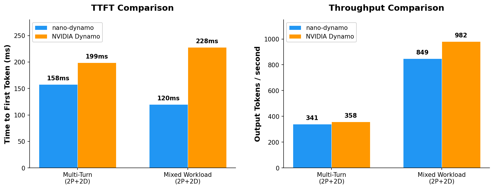

# nano-dynamo

> What happens when you strip NVIDIA Dynamo down to its core idea and rebuild it from scratch?

LLM inference is slow. One reason: when multiple requests share a prefix (like a system prompt), the first request computes a KV cache, and every subsequent request recomputes it from scratch. NVIDIA Dynamo fixes this by routing requests to workers that already have the cache. This project is a minimal reimplementation of that routing logic — ~1,850 lines of Python that show how it actually works.



## The problem

When you send a chat message to an LLM, the system prompt gets tokenized and processed into a KV cache before the model can start generating. If two users share the same system prompt, that work happens twice. In production, this wastes GPU time and increases latency — the time before you see the first token.

The standard approach is "disaggregated inference": split the work into two phases.

- **Prefill** — Process the prompt and build the KV cache
- **Decode** — Generate tokens using that cache

Dynamo's insight: route requests to the prefill worker that already has the most cached context. Less recompute, faster responses.

## How it works

```
                        ┌─────────────────────────────────────────────────────────┐
                        │                      ROUTER                             │
  CLIENT REQUEST        │                                                         │
  ───────────────       │   ┌─────────────────────────────────────────────────┐   │
                        │   │  STEP 1: PICK PREFILL WORKER                    │   │
 "You are a helpful  ──►│   │                                                 │   │
  assistant...          │   │  Radix tree: which GPU has this prefix cached?  │   │
  Tell me a joke"       │   │  Cost function: score =                         │   │
                        │   │    (tokens - cache_hits) / block_size           │   │
                        │   │    + decode_load                                │   │
                        │   │                                                 │   │
                        │   │  Pick lowest cost. Done.                        │   │
                        │   └─────────────────────────────────────────────────┘   │
                        │                          │                              │
                        │                          ▼                              │
                        │   ┌─────────────────────────────────────────────────┐   │
                        │   │  STEP 2: LOCAL OR REMOTE PREFILL?               │   │
                        │   │                                                 │   │
                        │   │  effective_prefill = tokens - cached_prefix     │   │
                        │   │                                                 │   │
                        │   │  If effective_prefill > 512 tokens              │   │
                        │   │     OR queue_depth >= 4:                        │   │
                        │   │       → offload to least-loaded remote GPU      │   │
                        │   │                                                 │   │
                        │   │  Otherwise: do it locally                       │   │
                        │   └─────────────────────────────────────────────────┘   │
                        │                          │                              │
                        └──────────────────────────┼──────────────────────────────┘
                                                   │
                                                   │  Gateway proxies HTTP POST
                                                   │  to chosen prefill worker
                                                   ▼
                                   ┌───────────────────────┐
                                   │  PREFILL GPU 0        │
                                   │  (chosen by router)   │
                                   │                       │
                                   │  Already has prefix:  │
                                   │  "You are a helpful   │
                                   │   assistant..."       │
                                   │                       │
                                   │  Only computes:       │
                                   │  "Tell me a joke"     │
                                   │                       │
                                   │  ┌─────────────────┐  │
                                   │  │  NIXL connector │  │  ← vLLM's NIXL handles the
                                   │  │  sends KV to    │  │    decode worker selection
                                   │  │  a decode GPU   │  │    internally. NOT the router.
                                   │  └────────┬────────┘  │
                                   └───────────┼───────────┘
                                                 │
                                                 │  KV cache
                                                 │  (NIXL GPU→GPU)
                                                 │  Direct transfer,
                                                 │  no CPU involved
                                                 ▼
                                   ┌───────────────────────┐
                                   │  DECODE GPU 2         │
                                   │                       │
                                   │  Receives KV cache    │
                                   │  Generates tokens     │
                                   │  Streams response     │
                                   └───────────────────────┘
```

**Key insight: the router only picks PREFILL workers.** The decode worker is NOT selected per-request by the router. It's handled by vLLM's NIXL connector internally — the prefill worker's NIXL connector transfers KV to a decode worker based on how they were started (`kv_rank`), not based on load or cache state.

**The cost function (scheduler.py:105):**

```
credit = cache_hits_on_gpu × 1.0     # each cached block reduces work
cost   = (tokens - credit) / 16      # blocks of work remaining
cost   += decode_load                 # don't overload busy GPUs
```

Lowest cost wins. With `temperature=0.0`, this is greedy — no randomness.

**The disaggregation decision (gateway.py:95):**

After picking a prefill GPU, the router checks: is the remaining work too big? If `effective_prefill > 512 tokens` or the GPU's queue has `≥ 4` requests waiting, it offloads to the least-loaded remote GPU instead.

**What the router does NOT control:**

Which decode worker receives the KV cache. That's vLLM-internal NIXL plumbing. The router's job ends at picking the prefill worker — everything after that is vLLM's NIXL connector shuttling GPU memory directly.

## Results

**Qwen/Qwen2.5-3B-Instruct on A10G, 2 prefill + 2 decode workers**

| Scenario | System | Time to first token | Throughput | End-to-end |
|----------|--------|---------------------|------------|------------|
| multi_turn | nano-dynamo | **158 ms** | 341 tok/s | 2574 ms |
| | NVIDIA Dynamo | 199 ms | **358 tok/s** | **2324 ms** |
| mixed_workload | nano-dynamo | **120 ms** | 849 tok/s | 3928 ms |
| | NVIDIA Dynamo | 228 ms | **982 tok/s** | **3163 ms** |

**What this means:** nano-dynamo routes faster (21-47% lower time-to-first-token) because HTTP has less handshake overhead than gRPC. NVIDIA Dynamo has higher throughput (5-16%) because gRPC's binary protocol is more efficient for bulk data. For real-time chat, TTFT matters more — users notice the delay before the first word appears.

## Try it

```bash
pip install modal
modal run benchmark_nano.py --scenario multi_turn
```

```bash
# 2 GPUs (1 prefill + 1 decode)
modal run benchmark_nano.py --scenario multi_turn --num-prefill 1 --num-decode 1

# 4 GPUs (default)
modal run benchmark_nano.py --scenario mixed_workload

# Compare with NVIDIA Dynamo
modal run benchmark_nvidia_dynamo.py --scenario multi_turn
```

| Scenario | What it tests |
|----------|---------------|
| `multi_turn` | Multi-turn conversations with shared system prompt (KV cache reuse) |
| `mixed_workload` | Variable sequence lengths simulating real chatbot traffic |

## Where to start reading

| File | Lines | What it does |
|------|-------|--------------|
| `src/gateway.py` | 319 | Entry point — the router that ties everything together |
| `src/scheduler.py` | 203 | Cost function: given a request and a worker, what's the score? |
| `src/radix_tree.py` | 170 | Prefix index: which workers have seen this prompt prefix before? |
| `src/block_pool.py` | 183 | Block state: free, in-flight, or committed? |
| `src/types.py` | 178 | Data structures |
| `src/engine.py` | ~400 | Worker inference engine |
| `src/vllm_sync.py` | 227 | vLLM metrics + NIXL GPU-to-GPU transfer |

Start with `gateway.py` — it's the router. Then `scheduler.py` to understand the cost model.

## License

MIT
