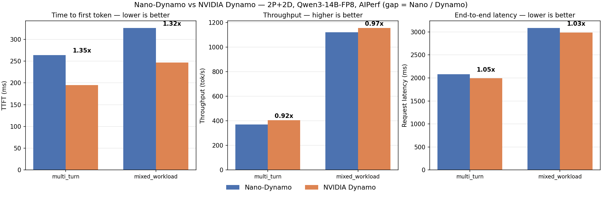

# nano-dynamo

An educational HTTP proxy (~1300 lines of Python) that approximates NVIDIA Dynamo's KV-aware routing for disaggregated LLM inference. Useful for understanding the routing logic — **not for production**.

## Benchmark: Nano-Dynamo vs NVIDIA Dynamo

> **TL;DR — a ~1000-line Python gateway is now within 1.35× of NVIDIA Dynamo's TTFT
> (12.7× before the fix), and within 3–9% on throughput and latency — same 4× A100s,
> same model, same AIPerf load.** The routing logic is the interesting part:
> [`src/gateway.py`](src/gateway.py) (cost function at `gateway.py:92-240`).



Regenerate with `python benchmark_charts.py` (data lives in `BENCHMARK_RESULTS.md`).

### Settings (identical on both systems)

| Setting | Value |
|---------|-------|
| Model | `Qwen/Qwen3-14B-FP8` |
| Hardware | 4× A100 (2 prefill + 2 decode) on Modal, CUDA 12.1 |
| Engine | vLLM 0.26 (`--enable-prefix-caching`) |
| KV transfer | NIXL, push mode (`NixlPushConnector`), side channel over localhost |
| KV config | `block_size=64`, `max_model_len=32768`, `gpu_memory_utilization=0.85` |
| Frontend | Nano: Python FastAPI gateway on :8787 · Dynamo: Rust frontend on :8000 |
| Load tool | AIPerf (OpenAI chat, streaming, `ignore_eos:true`) |
| Scenario `multi_turn` | 30 conversations × 5 turns, ISL≈256, OSL≈128, concurrency 10 |
| Scenario `mixed_workload` | 200 requests, mixed ISL/OSL (128/512/1024), concurrency 20 |

Full numbers and run links: [`BENCHMARK_RESULTS.md`](BENCHMARK_RESULTS.md).

## Project status

This is a learning tool built by reading Dynamo's public docs and source. It implements the same **cost function formula** but is radically simpler in every dimension. You can read all the code in an hour.

## Architecture

```
                         ┌──────────────────────────────────────────────────┐
                         │              nano-dynamo gateway                │
                         │                                                  │
    POST /v1/chat/completions                                              │
         │                                                                │
         ▼                                                                │
     ┌──────────┐    ┌────────────────────────────────────┐              │
     │  _pick() │───►│  Phase 2: KvAwarePolicy.select()   │              │
     │          │    │                                    │              │
     │ tokenize │    │  cost = prefill_cost               │              │
     │ overlap  │    │       + decode_cost                │              │
     │ load     │    │       + active_request_weight       │              │
     │          │    │                                    │              │
     │          │    │  argmin / softmin                  │              │
     └──────────┘    └────────────────────────────────────┘              │
         │                         │                                      │
         │                   Phase 3: KVBM best_decode()                  │
         │                         │                                      │
         ▼                         ▼                                      │
    ┌────────────────────────────────────────────────────────────┐        │
    │  Prefill vLLM (HTTP)            Decode vLLM (HTTP)         │        │
    │  Runs prefill, capped at        Waits for remote KV, then  │        │
    │  1 token (max_tokens=1)         generates the full         │        │
    │                                response (OSL tokens)       │        │
    └────────────────────────────────────────────────────────────┘        │
         ▲                         ▲                                      │
         │   KV blocks pushed      │                                      │
         │   GPU-direct via NIXL   │                                      │
         └─────────────────────────┘                                      │
                         ┌──────────────────────────────────────┐         │
                         │  Phase 4: PreemptionManager          │         │
                         │  Phase 5: ScalingManager (stub)      │         │
                         └──────────────────────────────────────┘         │
```

### Phases

| Phase | What | Status |
|-------|------|--------|
| 1 | Disaggregated proxy (HTTP push to prefill + decode) | Done |
| 2 | KV-aware routing with Dynamo cost function | Done |
| 3 | KV Block Migration (block tracking + decode selection) | Done |
| 4 | Preemption & promotion (LRU eviction) | Done |
| 5 | Dynamic pool scaling (drain + auto-scale stub) | Done |

### Key files

| File | Lines | What |
|------|-------|------|
| `src/gateway.py` | 727 | FastAPI proxy, policy, CLI |
| `src/kvbm.py` | 189 | Block tracking + decode selection |
| `src/kv_index.py` | 38 | Prefix overlap computation |
| `src/kv_events.py` | 21 | Token-to-block-hash conversion |
| `src/preemption.py` | 168 | Session promotion + eviction |
| `src/scaling.py` | 148 | Drain + auto-scale (stub) |

## Cost function

Matching what we reverse-engineered from Dynamo's `kv_router.py`:

```
raw_prefill_blocks     = (active_prefill_tokens + input_tokens) / block_size
overlap_credit_blocks  = overlap_score_credit × overlap_blocks
adjusted_prefill       = max(raw_prefill_blocks - overlap_credit_blocks, 0)
prefill_cost           = prefill_load_scale × adjusted_prefill
decode_cost            = potential_decode_blocks
request_cost           = decode_active_request_weight × active_requests
logit                  = prefill_cost + decode_cost + request_cost
```

Select argmin (temperature=0) or softmin (temperature>0). Reservoir sampling for tied minima.

## What we actually have

- Dynamo-matching cost function with configurable overlap credit, temperature, load scale, and request weight
- Per-request config overrides via `router_config_override` in the request body
- Overlap credit decay (reduces credit on overloaded workers proportional to excess queued blocks)
- Prefill active token tracking across workers (counts inflight tokens)
- Decode selection with overlap credit=0 (pure load, since KV is transferred)
- Reservoir sampling for tie-breaking (Dynamo-equivalent)
- Softmin routing at temperature>0 (range-normalized)
- KV block placement tracking (radix-tree-free hash-matching)
- Decode worker load monitoring + migration planning
- LRU preemption with session promotion
- Drain + auto-scale stubs
- Push-mode KV disaggregation via vLLM's native `NixlPushConnector` (gateway orchestrates, NIXL moves blocks GPU-direct)
- AIPerf benchmark harness (`benchmark_nano.py`) with per-phase PROF diagnostics and engine-metric breakdown
- 16 unit checks, no GPU required (`python -m temp.test_nano`)

## What we DON'T have (vs real Dynamo)

### KV event transport
Dynamo uses NATS Core / JetStream / ZMQ for real-time, distributed KV events between workers and router. nano-dynamo is single-process in-memory. Restart the gateway, lose all state.

### GPU-direct KV transfer (NIXL)
Dynamo's router integrates NIXL orchestration (NVLink/GPUDirect RDMA, zero CPU copies, multi-rail scale-out). nano-dynamo does **not** move KV itself — it delegates the transfer to vLLM's native `NixlPushConnector`, which runs on the same GPUs via UCX. On Modal (4 GPUs in one container) transfers ride intra-node NVLink; Dynamo's advantage is a production-grade, router-managed, scale-out transfer layer, not a per-request protocol difference.

### Flash Indexer
Dynamo's indexer does 170M ops/s in C++/CUDA. nano-dynamo's `KvIndex` is a hash-based Python prefix matcher.

### Multi-replica router
Dynamo syncs router state across replicas for HA. nano-dynamo is a single point of failure.

### Priority scheduling (`--router-queue-threshold`)
Dynamo supports queue-threshold-based prioritization. nano-dynamo is FCFS-only.

### AIC prefill duration model (`--router-prefill-load-model aic`)
Dynamo optionally decays only the oldest active prefill using an ML-predicted duration. nano-dynamo decays uniformly.

### Standalone indexer
Dynamo can run `dynamo.indexer` as an independent service. nano-dynamo's index is embedded in the gateway process.

### Tiered KVBM offload
Dynamo's KV Block Manager offloads to CPU → SSD → S3/Azure. nano-dynamo's "KVBM" is just block-location tracking + admission control.

### SLA planner
Dynamo has a formal SLA-based auto-scaler. nano-dynamo's ScalingManager is a 15-second stub loop.

### Kubernetes-native deployment
Dynamo has CRDs, shadow-engine failover, topology-aware KV transfer. nano-dynamo is `uvicorn.run(...)`.

### Multimodal, agentic, LangChain
Dynamo v1.2+ supports multimodal encode/prefill/decode, embedding cache, per-request agent priorities, SGLang subagent KV isolation. nano-dynamo is text-only; multi-turn support is limited to `conversation_id`-based KV reuse across turns.

### `--router-track-prefill-tokens` toggle
Dynamo exposes this as a runtime flag. nano-dynamo hardcodes it at True.

## Honest assessment

nano-dynamo gets the **routing math** approximately right. The cost function, softmin, overlap credit, and argmin selection are faithful to what Dynamo's `kv_router.py` does.

Everything else — event transport, index performance, distributed consistency, router-managed scale-out KV transfer, production readiness — is absent or replaced with a toy version. The benchmark above shows the remaining per-request gap is a ~70–80 ms Python gateway overhead against Dynamo's Rust frontend.

If you want to understand the routing algorithm, read `gateway.py:92-240`. If you want to serve traffic, use real Dynamo.

## Running

```bash
# Start gateway with 1 prefill + 1 decode vLLM
python -m src.gateway \
  --prefill-ports 8100 \
  --decode-ports 8200 \
  --model Qwen/Qwen3-14B-FP8 \
  --overlap-score-credit 1.0 \
  --prefill-load-scale 1.0 \
  --router-temperature 0.0
```

### Quick validation (no GPU)

```bash
python -m temp.test_nano
```

### Modal smoke test

```bash
pip install modal
modal run temp/smoke_test.py
```

## License

MIT
