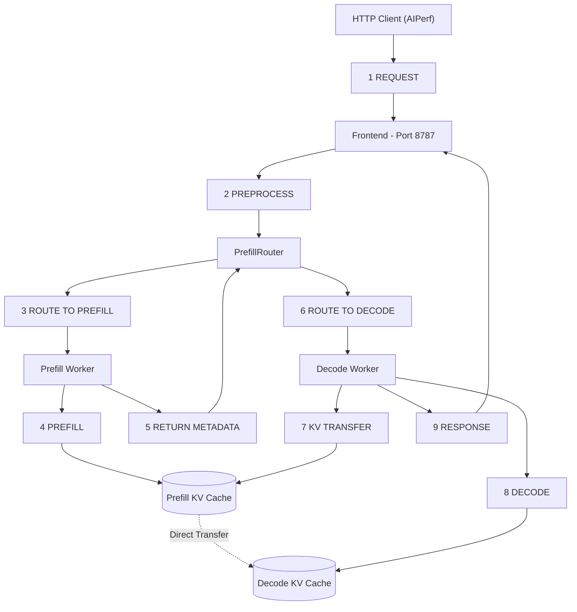

# mini-dynamo

A KV-aware routing proxy for disaggregated LLM inference — structured as a
readable map of [NVIDIA Dynamo's architecture](https://docs.nvidia.com/dynamo/dev/knowledge-base/concepts/architecture):
every folder is a diagram layer, every module a diagram box, every function an
edge label. Full traceability in [`docs/architecture.mmd`](docs/architecture.mmd).


```mermaid
graph TD
    Client["HTTP Client (AIPerf)"] --> S1["1 REQUEST"] --> Frontend["Frontend - Port 8787"]
    Frontend --> S2["2 PREPROCESS"] --> PrefillRouter["PrefillRouter"]
    PrefillRouter --> S3["3 ROUTE TO PREFILL"] --> PrefillWorker["Prefill Worker"]
    PrefillWorker --> S4["4 PREFILL"] --> PVCache[("Prefill KV Cache")]
    PrefillWorker --> S5["5 RETURN METADATA"] --> PrefillRouter
    PrefillRouter --> S6["6 ROUTE TO DECODE"] --> DecodeWorker["Decode Worker"]
    DecodeWorker --> S7["7 KV TRANSFER"] --> PVCache
    PVCache -.->|"Direct Transfer"| DVCache[("Decode KV Cache")]
    DecodeWorker --> S8["8 DECODE"] --> DVCache
    DecodeWorker --> S9["9 RESPONSE"] --> Frontend
```

## Benchmark: mini-dynamo vs NVIDIA Dynamo

2P+2D · Qwen3-14B-FP8 · vLLM 0.26 + NIXL push · AIPerf · 4×A100. Same topology,
model, and load on both systems — the only variable is the routing layer.

| Scenario | Metric | mini-dynamo | NVIDIA Dynamo | Gap |
|---|---|---|---|---|
| multi_turn (30 convs × 5 turns) | TTFT (ms) | 336 | 195 | 1.72× |
| | Throughput (tok/s) | 353 | 405 | 1.15× |
| | Latency (ms) | 2182 | 1992 | 1.10× |
| mixed_workload (200 reqs) | TTFT (ms) | 304 | 247 | 1.23× |
| | Throughput (tok/s) | 1141 | 1155 | 1.01× |
| | Latency (ms) | 2807 | 2984 | **0.94×** |

Throughput and latency at parity; the remaining TTFT gap is Python-frontend
overhead against Dynamo's Rust path (~70–80 ms measured) plus cold-start
accounting. Run history and per-block analysis: [`docs/blocks/`](docs/blocks/).

## Size

| Module | Lines | Diagram element |
|---|---|---|
| `src/frontend/frontend.py` | 500 | Frontend (S1/S2/S4–S9) |
| `src/router/prefill_router.py` | 331 | PrefillRouter (S3/S6, cost fn) |
| `src/infra/discovery.py` | 91 | Discovery |
| `src/router/sessions.py` | 83 | Affinity |
| `src/router/slot_manager.py` | 68 | Load snapshot |
| `src/router/kv_indexer.py` | 67 | KV lookup |
| `src/workers/prefill_worker.py` | 57 | Prefill handle + producer contract |
| `src/workers/decode_worker.py` | 30 | Decode handle |
| `src/infra/kv_events.py` | 30 | Block hashing |
| **Total** | **1,261** | |

Plus `tests/` (9 green, no GPU), `modal_proof.py` (10/10 on 2×A100),
`modal_bench.py` (this table's harness).

## Run

```bash
# verify (no GPU)
PYTHONPATH=src uv run --with fastapi --with httpx --with xxhash \
  --with uvicorn --with pytest --no-project python -m pytest tests/ -q

# serve (needs vLLM prefill :8100 + decode :8200)
PYTHONPATH=src python -m frontend.frontend \
  --model Qwen/Qwen3-14B-FP8 --prefill-ports 8100 --decode-ports 8200 \
  --http-port 8787 --router-mode kv --block-size 64
```

## Scope

Routing math faithful to Dynamo's cost model (overlap credit + decay, argmin/
softmin, load-only decode leg); event transport, index throughput, HA, and
control plane intentionally out of scope — single process, static discovery,
in-memory state. Understand the algorithm here; serve traffic with Dynamo.
