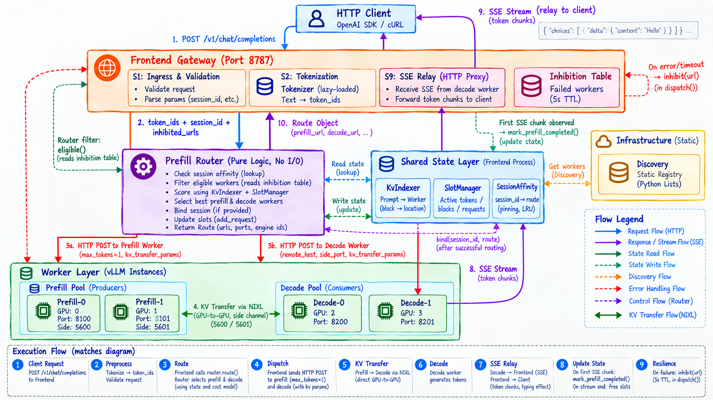

# nano-dynamo

A lightweight, OpenAI-compatible disaggregated LLM serving gateway. Features KV cache-aware routing, NIXL-based GPU-to-GPU prefill/decode separation, and session affinity — all in pure Python with zero external orchestration dependencies.



## Why This Architecture Exists

Modern LLM serving hits recurring bottlenecks:

- **Prefill/decode imbalance** leaves GPUs underutilized when traffic mix shifts ([DistServe](https://arxiv.org/abs/2401.09670)).
- **KV recomputation** increases TTFT and wastes compute when routing ignores cache overlap ([DeepSeek](https://arxiv.org/abs/2501.12948)).
- **Memory pressure** from long contexts and concurrency exceeds HBM capacity without KV cache offloading ([Mooncake](https://kvcache-ai.github.io/Mooncake/design/mooncake-store.html), [FlexKV](https://github.com/taco-project/FlexKV), [LMCache](https://lmcache.ai/)).
- **Dynamic demand** breaks static provisioning assumptions ([AzureTrace](https://github.com/Azure/AzurePublicDataset)).
- **Real-world failures** (pod restart, partition, hot-spot overload) require first-class recovery behavior.

This gateway addresses these constraints the way Dynamo does: by separating
serving, control, and state propagation into explicit planes — request plane
(`src/frontend`, `src/router`), state plane (`src/router/kv_indexer.py`,
`src/router/slot_manager.py`), and discovery (`src/infra/discovery.py`).

## Request Flow

The main request path is:

- **Request (S1):** HTTP client sends API request to Frontend (OpenAI-compatible server on `:8787`; official Dynamo uses `:8000`)
- **Preprocess (S2):** Frontend preprocesses the request (applies chat template, tokenizes) and validates it
- **Route to Prefill (S3):** PrefillRouter selects a prefill worker using KV-aware routing or load balancing

**Prefill**

- **Prefill (S4):** Prefill worker executes the prefill computation on the input tokens and generates KV cache
- **Return Metadata (S5):** Prefill worker returns `disaggregated_params` containing backend-specific transfer metadata

**Decode Routing**

- **Route to Decode (S6):** PrefillRouter injects prefill result into decode request and routes to decode worker
- **KV Transfer (S7):** Decode worker coordinates with prefill worker for direct GPU-to-GPU KV cache transfer via NIXL

**Completion**

- **Decode (S8):** Decode worker generates tokens using the transferred KV cache
- **Response (S9):** Generated tokens stream back through Frontend for post-processing (detokenization) and delivery to Client

Each stage maps to a named function in [`src/`](src/) — see the S-badge
banners in code and [`docs/architecture.mmd`](docs/architecture.mmd).

## Benchmark: nano-dynamo vs NVIDIA Dynamo

2P+2D · Qwen3-14B-FP8 · vLLM 0.26 + NIXL push · AIPerf · 4×A100. Same topology,
model, and load on both systems — the only variable is the routing layer.

| Scenario | Metric | nano-dynamo | NVIDIA Dynamo | Gap |
|---|---|---|---|---|
| multi_turn (30 convs × 5 turns) | TTFT (ms) | 336 | 195 | 1.72× |
| | Throughput (tok/s) | 353 | 405 | 1.15× |
| | Latency (ms) | 2182 | 1992 | 1.10× |
| mixed_workload (200 reqs) | TTFT (ms) | 304 | 247 | 1.23× |
| | Throughput (tok/s) | 1141 | 1155 | 1.01× |
| | Latency (ms) | 2807 | 2984 | **0.94×** |

Throughput and latency at parity; the remaining TTFT gap is Python-frontend
overhead against Dynamo's Rust path (~70–80 ms measured) plus cold-start
accounting. Run history and per-block analysis: [`docs/blocks/`](docs/blocks/).

## Size

<details>
<summary>Module line counts (click to expand)</summary>

| Module | Lines | Diagram element |
|---|---|---|
| `src/frontend/frontend.py` | 500 | Frontend (S1/S2/S4–S9) |
| `src/router/prefill_router.py` | 331 | PrefillRouter (S3/S6, cost fn) |
| `src/infra/discovery.py` | 91 | Discovery |
| `src/router/sessions.py` | 83 | Affinity |
| `src/router/slot_manager.py` | 68 | Load snapshot |
| `src/router/kv_indexer.py` | 67 | KV lookup |
| `src/workers/prefill_worker.py` | 57 | Prefill handle + producer contract |
| `src/workers/decode_worker.py` | 30 | Decode handle |
| `src/infra/kv_events.py` | 30 | Block hashing |
| **Total** | **1,261** | |

Plus `tests/` (9 green, no GPU), `proof_nano_dynamo_gpu.py` (10/10 on 2×A100),
`bench_nano_dynamo.py` (this table's harness).

</details>

## Benchmark on Modal (4×A100, AIPerf)

| Script | What it runs |
|---|---|
| `bench_nano_dynamo.py` | This gateway, 2P+2D load bench (this table's numbers) |
| `bench_nvidia_dynamo.py` | NVIDIA Dynamo 2P+2D reference under identical load |
| `bench_aggregated_control.py` | Single TP=4 engine control (no gateway, no transfer) |
| `proof_nano_dynamo_gpu.py` | Functional GPU smoke proof, 1P+1D (no AIPerf) |

```bash
modal run bench_nano_dynamo.py --scenario all       # multi_turn + mixed_workload
modal run bench_nvidia_dynamo.py --scenario all     # reference side
modal run bench_aggregated_control.py --scenario all # control
modal run proof_nano_dynamo_gpu.py                  # smoke test
```

## Test

```bash
# verify (no GPU)
PYTHONPATH=src uv run --with fastapi --with httpx --with xxhash \
  --with uvicorn --with pytest --no-project python -m pytest tests/ -q

# serve (needs vLLM prefill :8100 + decode :8200)
PYTHONPATH=src python -m frontend.frontend \
  --model Qwen/Qwen3-14B-FP8 --prefill-ports 8100 --decode-ports 8200 \
  --http-port 8787 --router-mode kv --block-size 64
```

## References

- [NVIDIA Dynamo documentation](https://docs.nvidia.com/dynamo/) — architecture, router design, planner
- [ai-dynamo/dynamo](https://github.com/ai-dynamo/dynamo) — the reference implementation this gateway maps to
- [vllm-project/vllm](https://github.com/vllm-project/vllm) — prefill/decode engines + NIXL push connector
- [ai-dynamo/aiperf](https://github.com/ai-dynamo/aiperf) — load generator behind the benchmark table 
